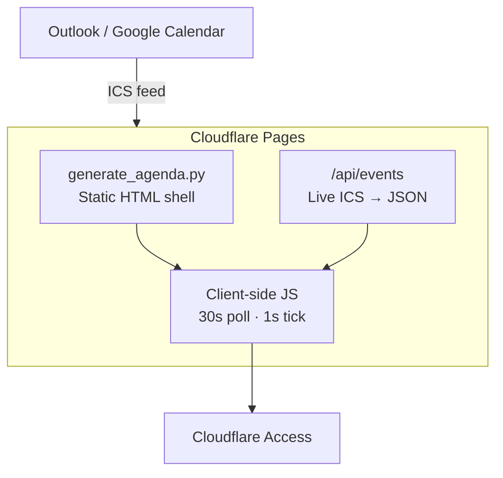

<div align="center">

<br>

# `Live Agenda`

**A private, real-time agenda dashboard powered by your calendar.**

[](https://python.org)
[](https://pages.cloudflare.com)
[](https://www.cloudflare.com/zero-trust/products/access/)

<br>

<sub>Dark mode by default · Glassmorphism UI · Secured with Cloudflare Access</sub>

---

</div>

<br>

## Architecture



<br>

## Features

| | Feature | Detail |
|---|---|---|
| **⚡** | **Live data** | Polls every 30s via edge function — no rebuild needed |
| **🕐** | **Real-time UI** | 1s tick updates countdowns, progress bars, and clock |
| **📅** | **Timeline view** | Events grouped by day with color-coded accent bars |
| **🔴** | **Live indicators** | Pulsing dot + "Now" / "In progress" badges |
| **🌗** | **Dark / Light mode** | Dark by default, toggle persisted in `localStorage` |
| **🧊** | **Glassmorphism** | Frosted-glass cards with `backdrop-filter: blur()` |
| **📱** | **Responsive** | Optimized for desktop, tablet, and mobile |
| **👁** | **Tab-aware** | Fetches fresh data the moment you switch back |
| **♿** | **Accessible** | `prefers-reduced-motion`, semantic HTML, print styles |
| **🌐** | **Edge-cached** | 30s `s-maxage` + stale-while-revalidate on API |

<br>

## Repo Structure

```
.
├── scripts/
│   └── generate_agenda.py    # ICS → static HTML shell + agenda.json
├── functions/
│   └── api/
│       └── events.js         # CF Pages Function — live ICS → JSON
├── site/                     # Build output (not committed)
├── requirements.txt          # icalendar>=6.0.0
└── README.md
```

<br>

## Setup

### 1 — Get your ICS link

> **Outlook** → Settings → Calendar → Shared calendars → Publish a calendar → copy the **ICS** URL

### 2 — Deploy to Cloudflare Pages

1. **Cloudflare Dashboard** → Workers & Pages → Create → Pages → Connect to Git
2. Select this repo
3. Build configuration:

   | Field | Value |
   |---|---|
   | Framework preset | `None` |
   | Build command | `pip install -r requirements.txt && python scripts/generate_agenda.py` |
   | Output directory | `site` |

4. Environment variables:

   | Variable | Required | Default |
   |---|---|---|
   | `ICS_URL` | **Yes** | — |
   | `AGENDA_TITLE` | No | `Live Agenda` |
   | `AGENDA_TIMEZONE` | No | `America/Los_Angeles` |
   | `WINDOW_HOURS` | No | `48` |
   | `MAX_EVENTS` | No | `40` |

5. Deploy 🚀

### 3 — Lock it down with Cloudflare Access

1. **Zero Trust Dashboard** → Access → Applications → Add → Self-hosted
2. Domain: your `.pages.dev` URL
3. Policy: **Allow** → Selector: **Emails** → your email
4. Save — visitors now need a one-time email code 🔒

<br>

## Local Development

```bash
export ICS_URL='https://...'
pip install -r requirements.txt
python scripts/generate_agenda.py
open site/index.html
```

> [!NOTE]
> The `/api/events` endpoint only runs on Cloudflare. Locally, the page shows build-time data only.

<br>

---
